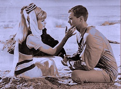

# CPYD-imgC
  Colorizado basico por threshold en C++ utilizando OpenCV y OpenMP.
  
## Requerimientos
  * OpenCV
  * OpenMP
  * GCC
  * Make

## Compilar

  ```make```

## Uso

  Para el uso correcto se debe ingresar una imagen de entrada y una imagen de salida por parametros.
  
  ```./imgC input.jpg output.png``` (formato de imagen intercambiable)
  
## Ejemplos

  Original                                      |  Resultado
  :-------------:                               |  :-------------:
  |  
              |  

 ##
 
  Felipe Perez Cares.
  
  Javier Cisternas Cristi.
